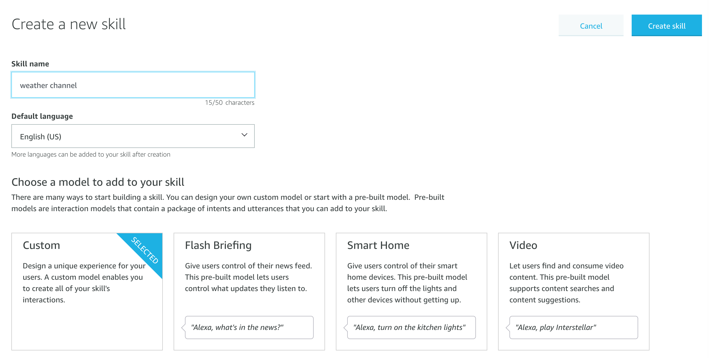

# Adventure World System Manual


##Accessing the code
The code is available at the GitHub repository: https://github.com/zahraessa/AdventureWorld


##Setting up the code
Prerequisites:
1.	Create an IBM Cloud account:
https://cloud.ibm.com/
2.	Install the IBM Cloud CLI: 
https://cloud.ibm.com/docs/openwhisk?topic=openwhisk-cli_install
3.	Create an Amazon Developer Portal account:
https://developer.amazon.com/

##Clone the repository:
$ git clone https://github.com/IBMIXN/UCLAdventureWorld
$ cd AdventureWorld

##Create a Watson Assistant Workspace:
1.	Create an IBM Cloud account
2.	Create a Watson Conversation skill by using this link: https://cloud.ibm.com/catalog/services/conversation
3.	Go to the skills tab and click create skill
4.	Select ‘Dialog Skill’
5.	Click ‘Upload Skill’


##Get relevant credentials:
1.	Click the three dots on the skill on the Skills page.
2.	Click ‘View API Details’
 
3.	Copy the Skill ID to the .params file from the cloned GitHub repository
4.	Go to your IBM Cloud Dashboard
5.	Go to the ‘Resource List’
6.	Click on the Watson Assistant skill
7.	From the manage tab copy the API key and URL to the .params file 
 
 

##Create the first OpenWhisk action:
1.	Run the following commands in your local AdventureWorld folder:
1. npm install
2.	rm action.zip
3.	zip -r action.zip app.js package* node_modules
4.	ibmcloud wsk action update AdventureWorld action.zip --kind nodejs:default --web raw --param-file .params

```sh
npm install
rm action.zip
zip -r action.zip main.js package* node_modules
ibmcloud wsk action update alexa-watson action.zip --kind nodejs:default --web raw --param-file .params
```


##Create the second OpenWhisk action:
1.	Run the following commands in your local AdventureWorld folder:
1. npm install
2.	rm action.zip
3.	zip -r action.zip apiCall.py package* libraries
4.	ibmcloud wsk action update AdventureWorld action.zip --kind nodejs:default --web raw --param-file .params

```sh
npm install
rm action.zip
zip -r action.zip main.js package* node_modules
ibmcloud wsk action update alexa-watson action.zip --kind nodejs:default --web raw --param-file .params
```


##Create the Alexa Skill:
1.	Create Skill. 


2.	Set the name to ‘AdventureWorld’ and start from scratch and set the backend resources to Alexa-hosted (Node.js).
3.	Set invocation name to ‘adventure world’.
4.	Create a custom slot type named ‘BAG_OF_WORDS’ with the value ‘Hello World’.


5.	Create a custom intent ‘EverythingIntent’ and set the sample utterances to {EveryThingSlot}.


6.	Set the Slot Type for EveryThingSlot to BAG_OF_WORDS.
7.	Get the endpoint from the IBM OpenWhisk action.
8.	Set the service endpoint type in the Amazon Development Console to HTTPS. Then set the endpoint value by pasting the URL from the OpenWhisk action and appending the ‘.json’ suffix to the service endpoint. Use the pull-down to select My development endpoint is a sub-domain of a domain that has a wildcard certificate from a certificate authority. 
 


# Adventure World User Guide
1)	Say ‘Alexa, open Adventure World’.
2)	Answer the companion’s questions to set your name and your companion’s name.
3)	Follow the companion’s instructions to move around.
4)	Use ‘help’ to get help or get a hint on solving a puzzle.
5)	Use ‘look around’ to get a description of the area around you and what you can do.

